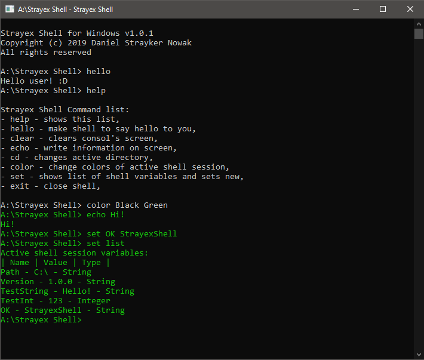

# Strayex Shell

Simple, lightweight and independent Command Line Interface shell for operating systems (Windows, Linux) and Hobby OS (Intel i386).
This software is able to manage terminal out Windows, Linux and MacOS, or in virtual machine with custom OS. In near future, Strayex Shell will be added to [StrayexOS](https://github.com/StraykerPL/StrayexOS) as basic system shell.

# Using

There are two three to get Strayex Shell on your computer. All options will require at least [.NET Core 2.1]([https://dotnet.microsoft.com/download/dotnet-core/2.1](https://dotnet.microsoft.com/download/dotnet-core/2.1) and/or additional software.

First option: download of ready-to-roll files from my website.

- Go to https://straykerpl.github.io/downloads

- Find Strayex Shell in the table, click "Download" next to the build package of your target system and wait for finish of download

- Enter the downloaded archive and run "setup.exe"

- The Windows Command Processor window should start, process with instructions in window to finish preparation of shell

- After that, window should disappear and the shortcut to shell should be on desktop

- Double-click the shortcut and shell will start!

Second option: download of Git repository and extracting files from it.

This option will require Git version control system on your computer.

- Go to https://github.com/StraykerPL/StrayexShell

- Click on green button called "Clone or download"

- Copy the given URL to Git terminal with clone command:
  
  `git clone https://github.com/StraykerPL/StrayexShell.git`

- Press Enter and wait for download to finish

- Go to "StrayexShell" folder and enter folder, that match your system and ends with "_publish", for example `windows_publish` for Windows build

- Copy all files from folder on your computer's drive in place where you want to

- Delete the repo from computer

- Additionally, you can create a shortcut on desktop to access file easier

Third option: build Strayex Shell by yourself.

This option will require Git version control system and Visual Studio distribution with added .NET SDK supporting .NET Core 2.1 on your computer.

- Go to [https://github.com/StraykerPL/StrayexShell](https://github.com/StraykerPL/StrayexShell)

- Click on green button called "Clone or download"

- Copy the given URL to Git terminal with clone command:
  
  `git clone https://github.com/StraykerPL/StrayexShell.git`

- Press Enter and wait for download to finish

- Go to "StrayexShell" folder and run "StrayexShell.sln", this should start Visual Studio

- The solution is already configured for building, just right-click on project called "StrayexShellWindowsLinuxMac" and click "Publish"

- The tab of publish configuration should appear. Choose where to build app and for what platform

- After completion of configuration, click "Publish" and wait for "Ready" label in left lower corner of Visual Studio

- After that go to build folder and check if Strayex Shell is running properly, for example run command "hello" that should display `Hello User! :D`

# Licensing

This project is published under [MIT/X11 license](https://github.com/StraykerPL/strayex_shell/blob/master/LICENSE).

# Contact

If you want to contact me join [Strayex Discord server](https://discord.gg/uAEwHHp).
